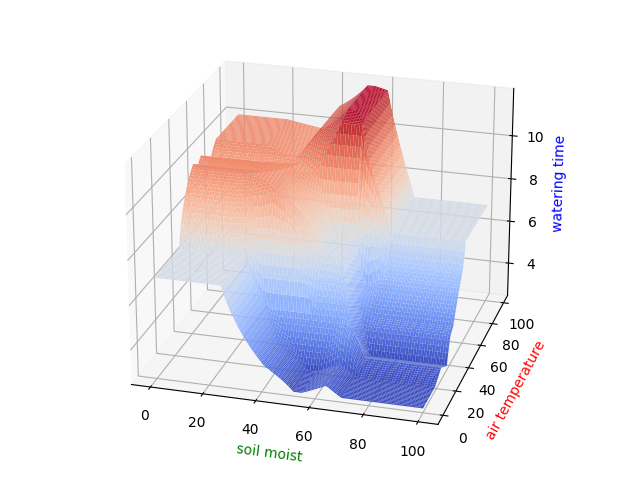
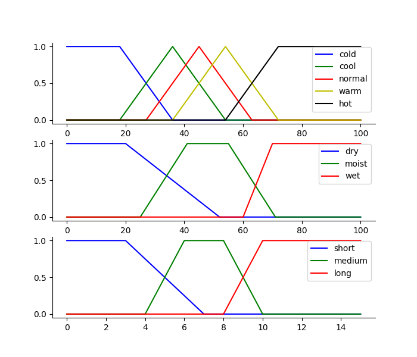
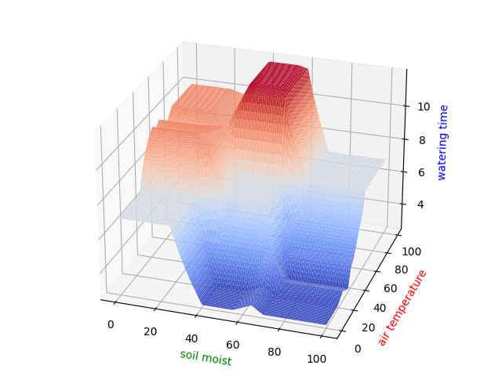
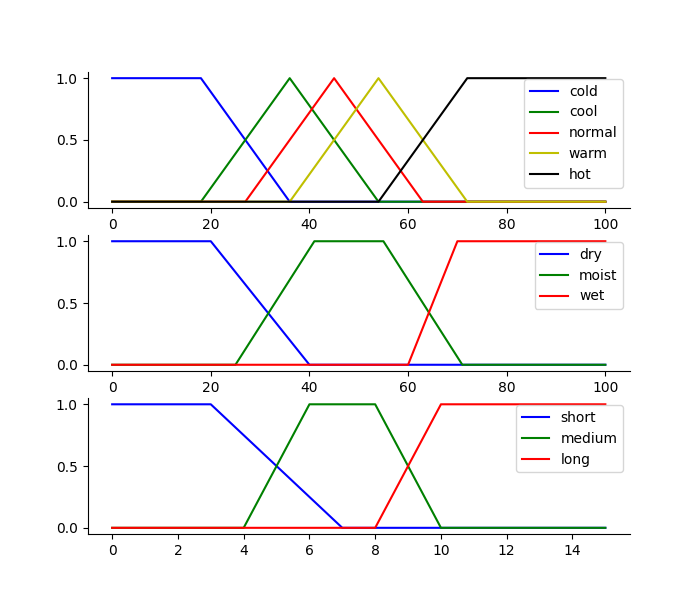

# Fuzzy Control of Watering System

You are going to define your own membership functions, rules and design the program of gardener watering. Observe its performance surface and make appropriate adjustments on membership functions and rules.

* Outputs make sense
* Rules identify desired behavior
* Labels have correct shape and overlap by exhaustively various input combinations: 
    1. At extreme ends of universe of discourse
    2. At extreme ends of the individual M.F.’s domain
    3. Corresponding to the overlap of M.F.
    4. With some degree of truth in as many antecedents as possible

---

**version1**  

     

**version2** 

     

 
In the performance surface of v1 and v2, ones could easily find out it doesn’t make sense, due to the dry soil moisture doesn’t according to the highest watering time in soil moisture axes. Thus, I just try to adjust the membership function so that the highest watering time could move to the driest situation. Besides, from v1 and v2 plots, ones could observe that as the overlapping area increase between dry and moist membership function the highest time will increase also toward the dry direction. 

