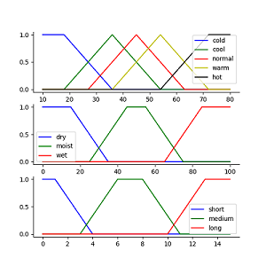

# Fuzzy Control of Watering System
Define your own membership functions and rules and design the program of gardener watering. Observe its performance surface and make appropriate adjustments on membership functions and rules.
1. Outputs make sense
2. Rules identify desired behavior 
3. Labels have correct shape and overlap by exhaustively various input combinations : 
   * At extreme ends of universe of discourse
   * At extreme ends of the individual M.F.’ domain
   * Corresponding to the overlap of M.F.
   * With some degree of truth in as many antecedents as possible

---

