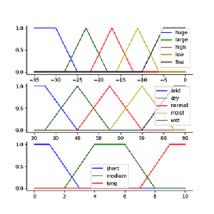
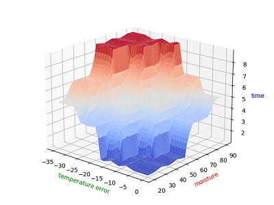
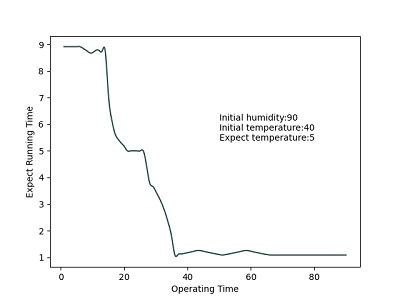
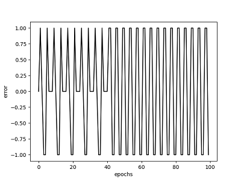
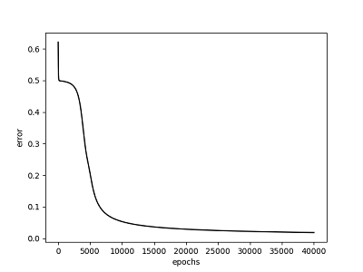
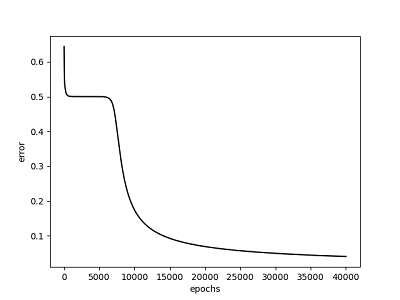

# Fuzzy Control, Back Propagation Neural Network

## Problem 1
Due to the input of the controller are the humidity and temperature difference, and the temperature is lying between 5 and 40 Celsius, ones could assume the error of temperature is between -35 to 0. In other words, as the desire temperature is 40 and the actual room temperature is 5 degree now, the error has negative maximum as -35. Besides, the error could not be positive because as the actual temperature higher than desire, ac could not give any help for adjusting temperature.

### Membership function / Surface Plot
   
From the surface plot, as the humidity get higher and temperature is heater than expect, the air conditioner will operate longer. In the other hand, ones the environment is dry and the temperature is cooler than expect, the expect running time become lower.

### Test Table
| error  |   humidity |  Time | 
| -------| ---------- | ------|
|  -35   | 90         |  9.066| 
|  -30   |  85        | 8.851 |
|  -28   |  80        |  8.690|
| -24    | 75         | 6.196 |
| -15    |70          | 5.166 |
| -7     |60          | 3.468 |
| 0      |0           | 0.533 | 

### Result
  
In above figures, I just give some assumption for the system and observe the situation. First, I just set the initial temperature and humidity to `40℃` and `90 %`, and I hope the temperature could become `5℃`. I also assume the change rates of temperature and humidity of the air conditioner is 0.5 degree per minute, both. And as the system compute, we could find out the needed running time starts to drop down. Ones the error and humidity are lower enough, the gradient of change rate gradually become gentle and converge into a little number, but not, zero, shutdown.

## Problem 2-1
  
From above figures, we could find out it doesn’t converge into expected result. After 13 epochs, the weight starts to leave around W11 = -0.099, W12 = ‐0.1 and W11 =1.38, W12 = ‐1.38, and get (1, 0, 0, 1) from output. Thus, this network could `not` solve the XOR problem and the training loop never terminates. Due to the less of hidden layer, it’s clear that a single perceptron will not serve XOR problem, because a perceptron network can only converge on linearly separable data.

## Problem 2-2
***Network 1***
|         |     w31  |     w32   |    w41  |     w42   |     w53  |     w54   |θ3 |θ4 |θ5|
| --------| -------- | ----------| --------| ----------| ---------|-----------|---|---|--|
| Initial |    0.2   |    -0.4   |    0.2  |    -0.2   |    0.1   |    -0.4   |0.8|-0.1|0.3|
| Final   |5.95760829|-6.05050661|5.8910454|-5.67968591|9.29823289|-9.01566577|3.24668351|-2.84693807|-4.26888588

|X1 |X2 |Yd |Y|
|---|---|---|-|
|0|0|0|0.01975951|
|0|1|1|0.97743721|
|1|0|1|0.98153622|
|1|1|0|0.0175678|

***Network 2***
|         |   W31| W32| W41 |W42| W43| θ3 |θ4|
| --------| -------- | ----------| --------| ----------| ---------|-----------|--|
| Initial |   0.2|-0.4|0.2|-0.2|-0.4|0.8|0.3|
| Final   |-7.7600312|-7.7601314|-6.3326193|-6.3326317|-13.850782|2.98515484|9.60968895|

|X1 |X2 |Yd |Y|
|---|---|---|-|
|0|0|0|0.02725621|
|0|1|1|0.95934547|
|1|0|1|0.9593455|
|1|1|0|0.04497656|

  
Using the backpropagation method, ones could adjust the weights and bias in hidden layer. As `40,000` epochs adjustments, we could find that both networks have converge into ideal result. From the true table, we could find out that the result could easy predict the for our expected XOR values. And from the above figures, we could observe that as the epochs times increase, the loss value will gradually decrease and converge into a small value. Thus, compare with `2-1` network that without hidden layer, the networks with hidden layer are more appropriate and practically using for solving the XOR problems.