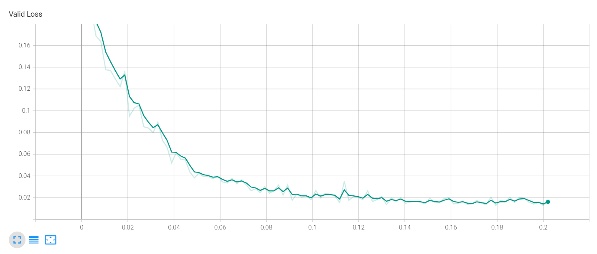
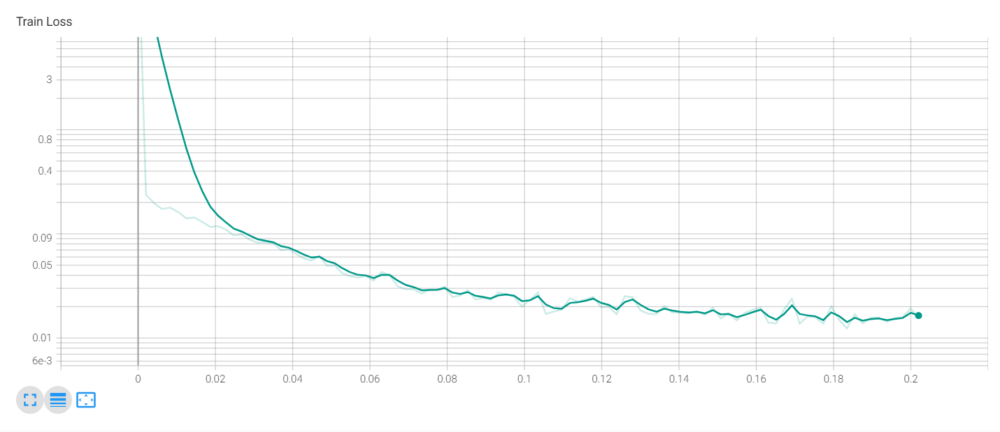
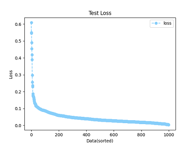

# Neural Network for Inverse Kinematics
## Inverse Kinematics
Build a inverse kinematics model by using ackpropagation neural network (`BPNN`) to solve `θ1`, `θ2`, `θ3` if X, Y, Z are given. The program of the model needs to be written in Python language and use the `Pytorch` package.

## Neural Network
In this problem, we just construct a network with two hidden layers and `100` neurons for each. The data is generated from forward kinematic equation first, then got the random data and target. We just split the dataset randomly, and go through training with mean square error loss function, backpropagation method and optimizer. The result is as the figure shown above, the training loss and validation loss get `0.01549` and `0.01618` respectively in the end. And ones could find that the losses are gradually converge into a small number. For more detail loss information, ones could find out the program in code file.

## Training / Validation

  
After the model training, we just test it with 1000 data. And as the figure shown, the loss has some high value like `0.6`, but basically lay on `0.0` to `0.1`. Besides, the fit line of the relationship between target and output of the model is very closely to expectation. Thus, we suppose that this model could properly predict the inverse kinematic relationship.

## Test Result
